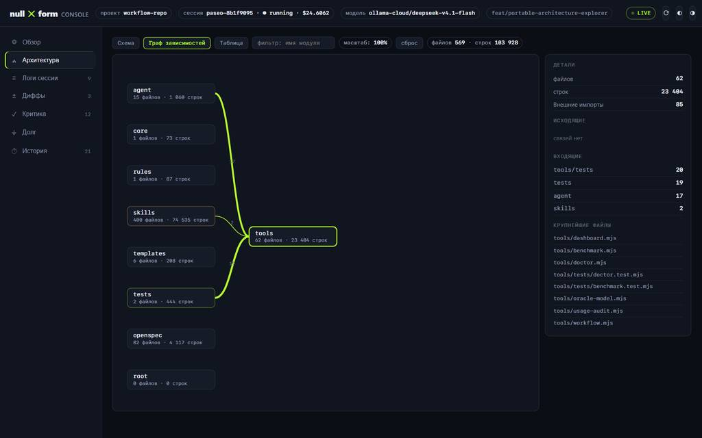

# NULLFORM WORKFLOW

[](https://github.com/wdnameless/nullform-workflow/actions/workflows/repo-gate.yml)
[](https://opensource.org/licenses/MIT)

**Portable engineering workflow harness for AI coding agents — hard gates over promises, verified tests over "done", live observability over guesswork.**  
**Переносимый инженерный каркас разработки для ИИ-агентов: строгие гейты вместо обещаний, проверенные тесты вместо «готово», наблюдаемость вместо догадок.**

Built for **Oh My Pi (OMP)** and **Paseo** with portable adapter generators for **Claude Code**, **Codex**, **OpenCode**, and **Cursor** on Windows, Linux, and macOS. Zero external npm dependencies (Node.js 18+ stdlib only) · 8 specialized roles · 69 skills · 33 CLI tools · 29 install & 15 audit checks.



---

## English

### Quickstart (3 Steps)

**1. Clone the repository**
```bash
git clone https://github.com/wdnameless/nullform-workflow.git "$HOME/nullform-src"
cd "$HOME/nullform-src"
```

**2. Install the adapter for your harness** (`omp|claude|codex|opencode|cursor|all` or `auto`)
```bash
node tools/install-harness.mjs --harness auto --root .
# Or full OMP + Paseo + MCP fleet setup on Windows:
# powershell -ExecutionPolicy Bypass -File install.ps1 -SecretsFile secrets.env
```

**3. Verify environment & run your first gated task**
```bash
node tools/doctor.mjs --harness .
node tools/workflow.mjs start --tier T1 --task "smoke check"
node tools/workflow.mjs artifact --kind recon --detail "environment verified"
node tools/workflow.mjs close
```

### Work Tiers (T0–T3)

| Tier | Scope / When to Use | Required Gates & Artifacts (`tools/workflow.mjs`) |
|---|---|---|
| **T0** | 1–2 known files, trivial local fix | Declared tier (`start --tier T0` → `close`); supports guarded `--auto` (`--max-diff <= 20`) |
| **T1** | 3+ files or unfamiliar area | Reconnaissance (`recon` artifact) before edits + verification before `close` |
| **T2** | Architecture change or new module | 4-Wave SDD: `manifest.md` (`R##`), OpenSpec `proposal/tasks/specs`, `interfaces.md`, blind `oracle` ACCEPT |
| **T3** | Multi-feature program or cross-cutting epic | Full T2 contract and blind Oracle acceptance per vertical slice |

### JEV: automatic skill hints, not model routing

JEV is a small decision model (`typesafe/jev-1.13`) used through OpenRouter Decisions. The native OMP extension selects a relevant **installed skill** before a main-agent turn; it does not execute the task, approve actions, or switch main/child models.

1. `before_agent_start` reads the effective native skill registry: identifiers and descriptions, not skill bodies.
2. The extension validates its v2 activation policy, current catalog fingerprint, report SHA-256, model snapshots and expiry. Sensitive, context-only or unsupported input is screened before dispatch.
3. A permitted current prompt and bounded skill metadata go to one typed skill-choice question. A real catalog ID at confidence **≥0.80** becomes a short extra turn message such as `Recommended skill: python-resilience`.
4. `none`, low confidence, opt-out, missing credentials/policy, stale evidence or an API error produce no hint: the existing agent workflow continues. JEV does not rewrite the stable system/catalog prefix.

**What this helps with:** selecting a suitable specialist instruction without adding a separate large-model classifier call. The hint remains advisory; the main agent still interprets the request, reads relevant instructions, writes code and runs the normal engineering gates. The full catalog remains available to that agent.

#### Measured improvement and its limits

The [complete live v2 report](openspec/changes/jev-automatic-assistance/evidence/live-skills-v2-measured.json) compares JEV with a separate `google/gemini-3.8-flash` skill-selection call using the same catalog. The constructed RU/EN corpus has **14 calibration + 44 held-out cases**; held-out metrics below cover **40 eligible inputs**, with four additional privacy canaries.

| Held-out metric | Gemini baseline | JEV |
|---|---:|---:|
| Confident/valid decisions | 40/40 | 36/40; four abstentions |
| Correct decisions | 37/40 | 36/36 attempted |
| Precision among attempts | 92.5% | 100% |
| Attempt coverage | 100% | 90% |
| Decision cost, including all 40 calls | $0.206936 | $0.012637 |
| Sum of request latencies, all 40 calls | 79.707 s | 16.414 s |

For this isolated decision step, cost fell **93.9% (16.4× lower)** and summed latency fell **79.4% (4.86× lower)**. This is not a whole-workflow speedup: JEV resolved **36/40** inputs versus **37/40** for the baseline, trading coverage for precision. No reduction in the main agent's catalog, token use, development time or subscription bill was measured.

The full paired run made **104 requests**, cost **$0.286911**, and recorded **zero API errors, unknown usage, safety misses and critical misses**. This total includes calibration and both arms; it is not the JEV-only held-out cost. Original negative/interrupted experiments are retained, not excluded to manufacture a passing result.

Evidence: [native/default-profile verification](openspec/changes/jev-automatic-assistance/evidence/current-profile-activation.json), [real redacted API cassette](openspec/changes/jev-automatic-assistance/evidence/skills-v2-api.cassette.json), [two independent ACCEPT verdicts](openspec/changes/jev-automatic-assistance/evidence/oracle-verdicts.json). Release verification: **538/538 tests passed**.

#### Operation

The current OMP profile is activated; new installations remain inactive until a complete, canonical v2 evaluation passes and is enabled once. Later turns need no per-task command.

```bash
node tools/jev-control.mjs status
node tools/jev-control.mjs disable
```

Credentials come from the native OS vault or `OPENROUTER_API_KEY` / `JEV_API_KEY`, never repository files. Privacy screening is a defensive filter, not a universal DLP guarantee. If catalog/model evidence changes or policy expires, hints stop until a new valid proof is enabled. An already running session may need normal reload to discover a newly installed extension; the installer does not restart the daemon.

Model routing was explicitly removed after negative results. The [`jev/`](jev/) directory is the user-provided **Claude-plugin reference**, not the active OMP extension and not part of automatic OMP installation. Implementation, evaluation and control details: [docs/jev.md](docs/jev.md).


### Key Commands & Architecture Links

- **Core Protocol & 4-Wave SDD**: [`core/PORTABLE.md`](core/PORTABLE.md) — harness-agnostic specification, roles (`orchestrator`, `designer`, `fixer`, `oracle`, `reviewer`, `librarian`, `explorer`, `sonic`), Lean A→B→A stage rhythm, and evidence protocol.
- **Domain Glossary & Topology**: [`CONTEXT.md`](CONTEXT.md) — definitions of live/repo trees, `<HARNESS>` substitution, Oracle-lite, dual-pass flash-class acceptance, prompt budgets, `defer:` debt markers, and sync/prune semantics.
- **Documentation & Visual Assets**: [`docs/`](docs/) — dashboard overview and visual artifacts (`node tools/dashboard.mjs --url`).
- **JEV Assistance & Evaluation**: [`docs/jev.md`](docs/jev.md) — skills-only runtime, canonical paired evidence, activation policy and local control CLI; measured results and limits are described above.
- **Always-On Agent Laws & Roles**: [`agent/AGENTS.md`](agent/AGENTS.md) · [`agent/agents/orchestrator.md`](agent/agents/orchestrator.md) · [`agent/plugins.json`](agent/plugins.json).
- **Verification, Sync & Quality Gates**:
  - `node tools/verify.mjs --profile verify` (29 install checks) · `--profile audit` (15 health checks)
  - `node tools/sync.mjs --check | --promote | --deploy | --prune` (wrapper scripts: `tools/sync.sh`, `tools/sync.ps1`)
  - `node tools/code-size.mjs check` · `node tools/debt-ledger.mjs scan --check` · `node tools/prompt-lint.mjs sizes --check`
  - `node tools/test-lens.mjs` · `node tools/benchmark.mjs` · `node tools/usage-audit.mjs` · `node tools/auto-review.mjs --root .`
  - CI template: [`templates/ci/workflow-gate.yml`](templates/ci/workflow-gate.yml) · Unit tests: `node --test tools/tests/*.test.mjs`

---

## Русский

### Быстрый старт (3 шага)

**1. Склонируйте репозиторий**
```bash
git clone https://github.com/wdnameless/nullform-workflow.git "$HOME/nullform-src"
cd "$HOME/nullform-src"
```

**2. Установите адаптер под ваш харнесс** (`omp|claude|codex|opencode|cursor|all` или `auto`)
```bash
./install.sh --harness auto --root .
# Или на любой ОС через Node.js:
node tools/install-harness.mjs --harness auto --root .
# Полная установка OMP (плагины, MCP-флот, Paseo) на Windows:
# powershell -ExecutionPolicy Bypass -File install.ps1 -SecretsFile secrets.env
```

**3. Проверьте установку и запустите первую задачу**
```bash
node tools/doctor.mjs --harness .
node tools/workflow.mjs start --tier T1 --task "проба"
node tools/workflow.mjs artifact --kind recon --detail "проверка окружения и инструментов"
node tools/workflow.mjs close
```

### Ярусы задач (T0–T3)

| Ярус | Когда применяется | Обязательные гейты и артефакты (`tools/workflow.mjs`) |
|---|---|---|
| **T0** | 1–2 известных файла, локальная правка | Объявленный ярус (`start --tier T0` → `close`); доступен защищённый `--auto` (`--max-diff <= 20`) |
| **T1** | 3+ файлов или незнакомая область | Рекогносцировка (`recon`) до правок и верификация перед `close` |
| **T2** | Архитектура или новый модуль | 4-Wave SDD: `manifest.md` (`R##`), OpenSpec `proposal/tasks/specs`, `interfaces.md`, слепая приёмка `oracle` (ACCEPT) |
| **T3** | Программа из нескольких фич | Полный цикл T2 и слепая приёмка Оракула на каждый вертикальный срез |

### JEV: автоматический подбор навыков, без переключения моделей

JEV — небольшая модель принятия решений (`typesafe/jev-1.13`), которую нативная extension OMP вызывает через OpenRouter Decisions. Она подсказывает **существующий установленный навык** перед ходом основного агента. Саму задачу, код и разрешения JEV не исполняет; модели основного агента и подагентов не переключает.

1. Хук `before_agent_start` получает реальный реестр навыков OMP: имена и описания, без загрузки их полного текста для JEV.
2. Проверяет политику v2, актуальный отпечаток каталога, SHA-256 отчёта, версию модели и срок действия доказательств. Чувствительные, контекстно-зависимые и неподдерживаемые входы отсекаются до отправки.
3. Допущенный текущий промпт и ограниченные метаданные навыков отправляются в один типизированный вопрос. Если ответ — реальный ID навыка с confidence **≥0.80**, агент получает короткую подсказку, например `Recommended skill: python-resilience`.
4. При `none`, низкой уверенности, opt-out, отсутствии ключа/политики, устаревших доказательствах или ошибке API подсказка не добавляется: прежний workflow продолжает работу. Стабильный system/catalog prefix JEV не переписывает.

**Чем помогает:** делает отдельный шаг выбора специализированной инструкции дешевле, чем отдельный вызов большой модели-классификатора. Подсказка рекомендательная: основной агент по-прежнему понимает задачу, читает инструкции, пишет код и проходит обычные инженерные гейты. Полный каталог навыков у него остаётся.

#### Доказательства улучшения и границы вывода

[Живой отчёт v2](openspec/changes/jev-automatic-assistance/evidence/live-skills-v2-measured.json) сравнивает JEV с отдельным вызовом `google/gemini-3.8-flash` для выбора навыка из того же каталога. Это сконструированная RU/EN-выборка: **14 калибровочных + 44 отложенных случая**. Метрики ниже относятся к **40 допустимым входам**; ещё четыре held-out случая проверяют защиту от чувствительных данных.

| Метрика на held-out | Baseline Gemini | JEV |
|---|---:|---:|
| Уверенные/валидные решения | 40/40 | 36/40; четыре воздержания |
| Правильные решения | 37/40 | 36/36 попыток |
| Точность среди попыток | 92,5% | 100% |
| Покрытие попытками | 100% | 90% |
| Стоимость решений, все 40 вызовов | $0.206936 | $0.012637 |
| Сумма задержек всех 40 вызовов | 79,707 с | 16,414 с |

На этом отдельном шаге стоимость ниже на **93,9% — в 16,4 раза**, сумма задержек — на **79,4% — в 4,86 раза**. Это не ускорение всего workflow: JEV решил **36/40** случаев, baseline — **37/40**. Выше точность уверенных ответов, но ниже покрытие. Уменьшение каталога, токенов основного агента, времени разработки или расходов по подписке не измерялось.

Полный парный прогон: **104 запроса**, **$0.286911**, **ноль ошибок API, неопределённых расходов, пропусков защитных канареек и критических ошибок**. Общая сумма включает калибровку и обе модели; её нельзя путать со стоимостью JEV на held-out. Отрицательные и прерванные эксперименты сохранены, а не отброшены ради положительного результата.

Дополнительные доказательства: [реальная активация профиля OMP](openspec/changes/jev-automatic-assistance/evidence/current-profile-activation.json), [запись настоящих API-ответов без секретов](openspec/changes/jev-automatic-assistance/evidence/skills-v2-api.cassette.json), [две независимые приёмки ACCEPT](openspec/changes/jev-automatic-assistance/evidence/oracle-verdicts.json). Проверки релиза: **538/538 тестов прошли**.

#### Управление

Текущий профиль OMP активирован. На новой установке JEV выключен, пока полный канонический бенчмарк v2 не пройдёт проверку и политика не будет однократно включена. После этого отдельные команды на каждой задаче не нужны.

```bash
node tools/jev-control.mjs status
node tools/jev-control.mjs disable
```

Ключ берётся из OS-хранилища или `OPENROUTER_API_KEY` / `JEV_API_KEY`, не из файлов репозитория. Фильтр чувствительных данных — защитный барьер, не универсальная DLP-гарантия. При изменении доказательств/каталога или истечении политики подсказки прекращаются до новой валидной оценки. Уже открытой сессии может понадобиться обычный reload; установщик не перезапускает daemon.

Маршрутизация моделей удалена по согласованному решению. Папка [`jev/`](jev/) — предоставленный пользователем **референс Claude-плагина**, а не действующая extension OMP; автоматически она не устанавливается. Реализация и команды оценки: [docs/jev.md](docs/jev.md).


### Документация, канон и инструменты

- **Портативное ядро и 4-Wave SDD**: [`core/PORTABLE.md`](core/PORTABLE.md) — независимая от среды спецификация процесса, роли (`orchestrator`, `designer`, `fixer`, `oracle`, `reviewer`, `librarian`, `explorer`, `sonic`), бережливый цикл A→B→A и протокол доказательств.
- **Глоссарий домена и топология**: [`CONTEXT.md`](CONTEXT.md) — устройство live/repo-деревьев, подстановка `<HARNESS>`, двойная приёмка на flash-моделях, Oracle-lite, бюджеты промптов, маркеры техдолга `defer:` и правила синхронизации.
- **Материалы и дашборд**: [`docs/`](docs/) — живой дашборд наблюдаемости (`node tools/dashboard.mjs --url`, автозапуск при `workflow.mjs start`).
- **JEV-ассистент и оценка пользы**: [`docs/jev.md`](docs/jev.md) — skills-only реализация, канонический парный бенчмарк, политика активации и CLI; результаты и ограничения приведены выше.
- **Законы агентов и шаблоны CI**: [`agent/AGENTS.md`](agent/AGENTS.md) · [`agent/agents/orchestrator.md`](agent/agents/orchestrator.md) · [`templates/ci/workflow-gate.yml`](templates/ci/workflow-gate.yml).
- **Проверка и сопровождение**: `node tools/verify.mjs --profile verify` (29 проверок) · `node tools/verify.mjs --profile audit` (15 проверок) · `node --test tools/tests/*.test.mjs`.

---

## License / Лицензия

MIT
